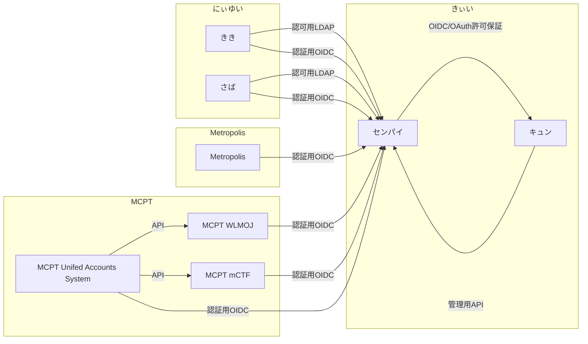

# きぃい

## Components

### Airy - Authn/authz server (`/airy`)
NOTE: (mainly) API only, no "frontend"
- OIDC OP
- LDAP proxy

### Yuui - Frontend (`/yuui`)
- basicalyl everything "frontend"

## AF Verifiers

- `pw` - password / pre-shared key (Airy currently uses Argon2id, can use Django's PBKDF2 hashes, but not for new ones)
- `otp_totp` - TOTP (currently only SHA1)
- TODO `ctrl_email` - Control of Email Address
- TODO `ctrl_ed25519` - Control of Ed25519 Private Key
- TODO `ctrl_dns` - Control of DNS Records (mainly for backup APs?)
- TODO `ctrl_oidc` - Control of OIDC End-User
- TODO `ctrl_ldap` - Control of LDAP user
- TODO `webauthn` - WebAuthn (probably the best)
